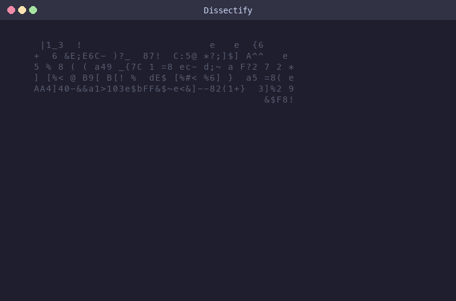

# Dissectify

**macOS Forensic Analysis Toolkit**

*"Every artifact tells a story. Every byte holds a truth."*

Dissectify is an all-in-one macOS forensic analysis toolkit that streamlines the entire DFIR workflow — from building Velociraptor collectors to validating collections and exporting parsed artifacts into analyst-ready XLSX workbooks.

Built on top of the [Dissect](https://github.com/fox-it/dissect) framework with 61 custom macOS forensic plugins and 70 Velociraptor collection artifacts.



---

## Features

### Collection & Deployment
- **Download Velociraptor** — Pulls the latest macOS binaries (Intel + Apple Silicon) from Velocidex releases
- **Build Collector** — Auto-generates `spec.yaml` from your YAML artifacts and builds a standalone offline collector
- **Collector Guide** — Step-by-step instructions with ready-to-copy commands
- **70 YAML Collectors** — Comprehensive macOS artifact collection covering browsers, communications, user activity, persistence, security, system config, logs, filesystem, network, and more

### Analysis & Export
- **Collection Health Check** — Validates artifact presence, SQLite WAL completeness, FDA/SIP inference, and provides actionable recommendations
- **Visual Summary** — Per-category breakdown with percentage bars, color-coded artifact table, and FDA status
- **Artifact Workbook** — Runs all 61 dissect plugins against a collection and exports a multi-sheet XLSX workbook with one sheet per artifact
- **61 Dissect Plugins** — Custom macOS forensic parsers covering:

| Category | Artifacts |
|---|---|
| **Web** | Safari, Chrome, Edge, Brave, Firefox — history, downloads, bookmarks, cookies, logins |
| **Communication** | iMessage, FaceTime, Call History, Contacts, Notifications, Apple Notes |
| **Execution** | KnowledgeC, Biome, ScreenTime, Spotlight, LaunchPad, Interactions |
| **Persistence** | LaunchAgents/Daemons, Kernel Extensions, System Extensions, Cron Jobs |
| **Security** | TCC (privacy permissions), Firewall, Keychain, Profiles, Exec Policy |
| **System** | Preferences, OS Info, Users, Logs (ASL/Audit), CrashReporter, PowerLogs |
| **Filesystem** | FSEvents, DS_Store, Document Revisions, Trash, QuickLook |
| **Network** | WiFi Intelligence, SSH, ARD, Microsoft RDC, Screen Sharing |
| **Auth** | UTMPX, Sudo Logs, Shell History |
| **Accounts** | Local accounts, iCloud, Account properties and credentials |

### TUI Interface
- **Terminal-based UI** powered by [Textual](https://github.com/Textualize/textual) — no browser needed
- **Path autocomplete** with Tab completion
- **Tabbed results** — Summary, Artifacts, Parse, and Collector views
- **Remembers paths** across sessions
- **Auto-detects bundled plugins** — works out of the box

---

## Quick Start

### Prerequisites
- macOS
- Python 3.10+
- Git (for plugin/collector updates)

### Install & Run

**Option 1: Double-click**
```bash
git clone https://github.com/MrJayTechie/Dissectify.git
cd Dissectify
# Double-click Dissectify.command in Finder
```
First launch automatically creates a virtual environment and installs all dependencies.

**Option 2: Command line**
```bash
git clone https://github.com/MrJayTechie/Dissectify.git
cd Dissectify
python3 -m venv .venv
.venv/bin/pip install -e .
.venv/bin/dissectify
```

**Option 3: pip install**
```bash
pip install git+https://github.com/MrJayTechie/Dissectify.git
dissectify
```

---

## Workflow

### Step 1: Setup
- Click **Download Velociraptor** to get the latest macOS binaries
- Click **Update Plugins** / **Update Collectors** to pull the latest from GitHub

### Step 2: Collect
- Click **Build Intel** or **Build Apple Silicon** to create an offline collector
- Deploy the collector on the target Mac:
```bash
sudo ./velociraptor-darwin-amd64 -- --embedded_config builds/Collector-darwin-amd64
```
- Extract the collection:
```bash
bsdtar -xf Collection-<hostname>-<timestamp>.zip -C /path/to/output
# or
ditto -xk Collection-<hostname>-<timestamp>.zip /path/to/output
```
> Always extract to APFS, never exFAT.

### Step 3: Analyze
- Enter the extracted collection path in Dissectify
- Click **Health Check** to validate the collection and check FDA/SIP status
- Click **Generate Workbook** to parse all artifacts and export to XLSX
- Click **Open XLSX** to view results

---

## Project Structure

```
Dissectify/
├── Dissectify.command        # Double-click launcher
├── plugins/                  # 61 macOS dissect plugins
├── collectors/               # 70 Velociraptor YAML collectors
├── velociraptor/             # Downloaded binaries (after setup)
├── builds/                   # Built collectors (after build)
├── pyproject.toml
├── demo.gif
└── src/macos_ir/
    ├── app.py                # Textual TUI
    ├── config.py             # Settings, downloads, build logic
    ├── health.py             # Collection health engine
    ├── plugins.py            # Plugin registry
    └── workbook.py           # Plugin runner & XLSX writer
```

---

## Collection Health Check

The health check validates a Velociraptor macOS collection by checking:

- **Artifact Presence** — Verifies 70 expected artifacts are present in the collection
- **SQLite WAL Completeness** — Checks that database WAL/SHM files were collected (missing WAL = potential data loss)
- **Full Disk Access (FDA)** — Infers whether the collector had FDA based on which protected artifacts are present
- **SIP-Blocked Artifacts** — Identifies artifacts that are expected to be missing on SIP-enabled systems
- **Actionable Recommendations** — Flags issues and suggests fixes

---

## Requirements

| Dependency | Purpose |
|---|---|
| [dissect.target](https://github.com/fox-it/dissect) | Forensic artifact parsing framework |
| [textual](https://github.com/Textualize/textual) | Terminal UI framework |
| [openpyxl](https://openpyxl.readthedocs.io/) | XLSX workbook generation |

All dependencies are installed automatically.

---
